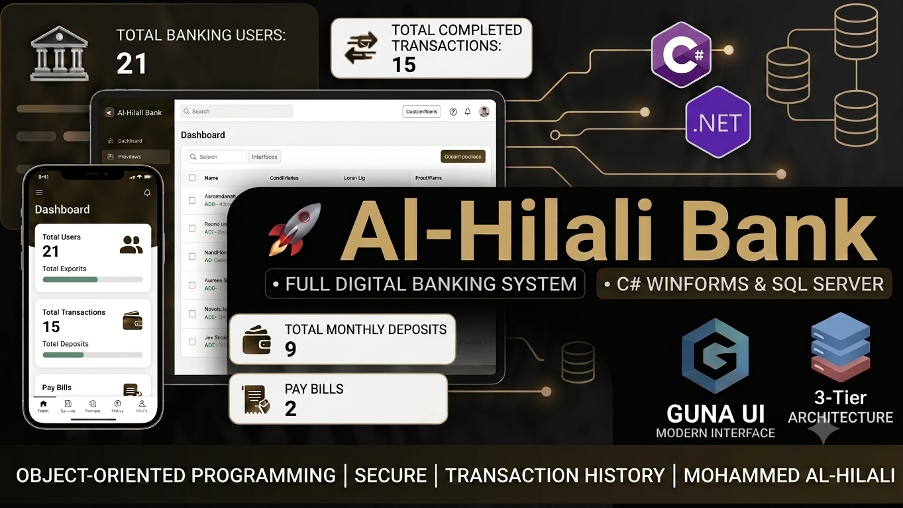

  

## 🏦 About The Project
**Al-Hilali Bank** is an advanced desktop application built as a comprehensive capstone project to demonstrate enterprise-level architectural patterns and production-ready data management. Developed utilizing C# and SQL Server, the system focuses heavily on robust logic, security, and scalable execution rather than simple syntax memorization.

---

## 🛠 Architectural & Technical Framework

The project is architected from the ground up using core software engineering patterns learned throughout my structured learning journey:

### 1. 3-Tier Architecture
The solution enforces a strict separation of concerns by splitting the system into three distinct layers:
* **Presentation Layer (UI):** Built with modern desktop elements using C# WinForms and enhanced visual components (Guna2 UI) to maintain soft shadows and clean interfaces.
* **Business Logic Layer (BLL):** Handles all core processing logic, verification routines, validations, and computational rules.
* **Data Access Layer (DAL):** Manages raw data interactions, structural integrity, and structural mapping.

### 2. Robust Database Connection (ADO.NET)
* Fully integrated with **Microsoft SQL Server** leveraging native **ADO.NET** data providers.
* Utilizes secure connection pooling and parameterized relational queries to ensure data isolation and prevent SQL injection vulnerabilities.

### 3. Industry-Standard Clean Code
* Implements robust **Object-Oriented Programming (OOP)** principles.
* Written strictly following clean code guidelines, meaningful naming conventions, structural refactoring, and separation of duties to ensure long-term maintenance and code readability.

---

## 🌟 Key Features
* **Multi-Tier User Management:** Fine-grained authorization permissions for banking personnel.
* **Transactional Operations:** Seamless deposit, withdrawal, and transfer auditing system with secure internal validations.
* **Currency Exchange Engine:** Real-time update rates and integrated currency conversions.
* **Robust Client Records:** Client profile creation, management, custom tracking parameters, and unified photo rendering features.
* **Resource Optimization:** Integrated file structures managing localized resource assets (including distinct country flags and visual identifiers).

---

## 💻 Tech Stack
* **Language:** C# (.NET Framework)
* **Database:** Microsoft SQL Server
* **Data Access:** ADO.NET
* **UI Controls:** WinForms & Guna2 UI Component Suite
* **Version Control:** Git & GitHub

---

## 👥 Educational Context
This project serves as a major milestone within the structured software development curriculum of the **Programming Advices** community under the guidance of **Dr. Mohammed Abu-Hadhoud**. It bridges academic foundations with practical corporate application standards.

---

## 📫 Connect with me:
* **LinkedIn:** [Mohammed Al-Hilali](https://www.linkedin.com/in/m-alhilali)
* **GitHub Profile:** [@m-alhilali](https://github.com/m-alhilali)
* **Email:** alward7133@gmail.com
